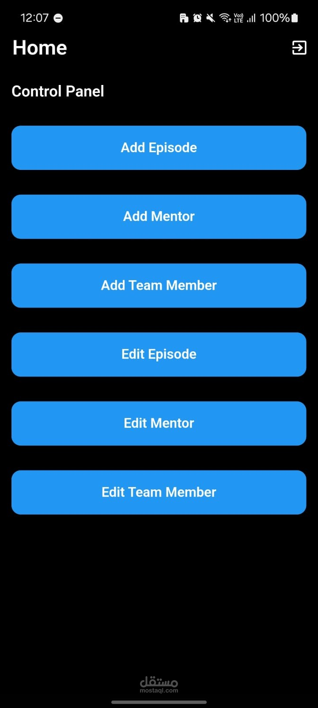
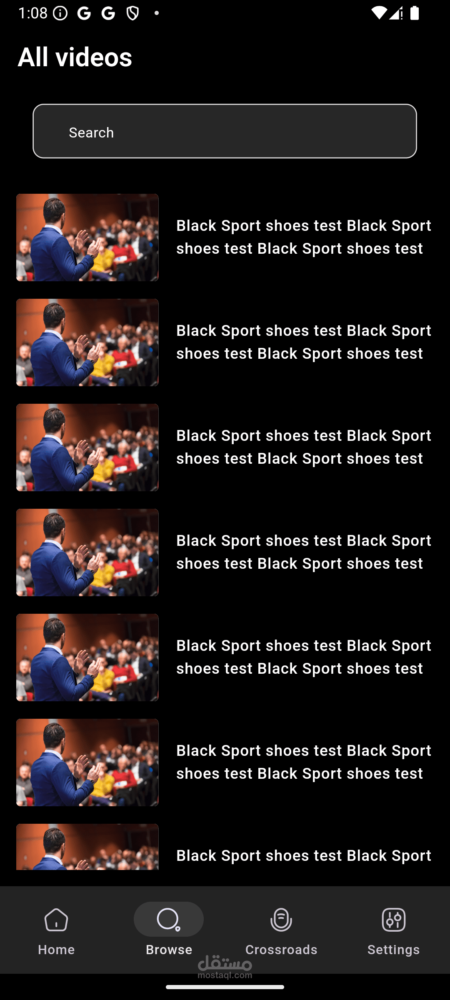
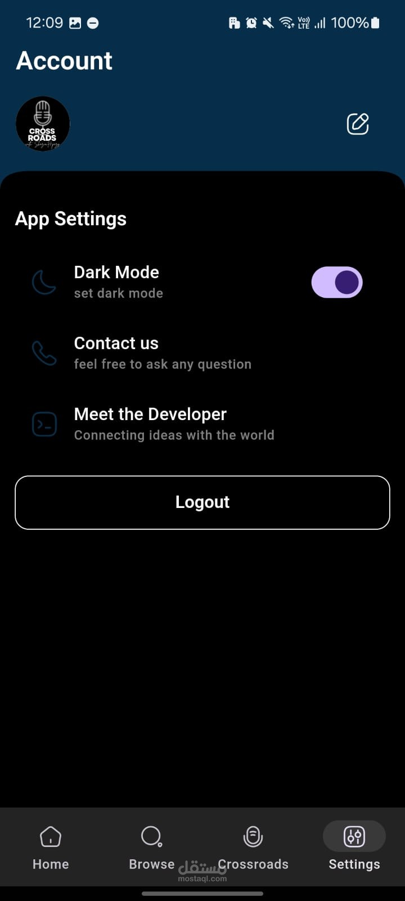
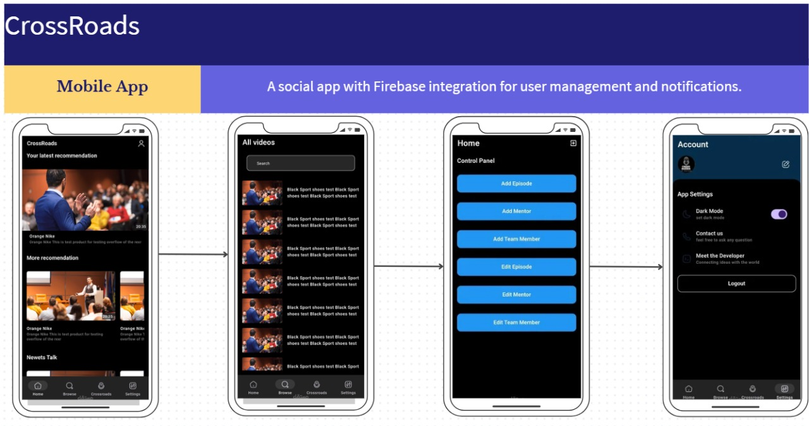

# 🌐 Crossroads App

**Crossroads** is a modern, high-performance mobile application built with Flutter, designed to provide a seamless and intuitive shopping and media experience. Leveraging the power of Firebase and GetX, Crossroads offers robust authentication, real-time data synchronization, and a beautiful, responsive UI.


## 🚀 Key Features

- **🔐 Secure Authentication**: Integrated Google Sign-In and Firebase Authentication for a smooth and secure onboarding experience.
- **☁️ Firebase Integration**: 
  - **Cloud Firestore**: Real-time NoSQL database for efficient data management.
  - **Firebase Storage**: Secure media and file storage.
  - **FCM (Push Notifications)**: Real-time user engagement and alerts.
- **📱 Modern UI/UX**:
  - **GetX State Management**: Clean, efficient, and reactive state management.
  - **Lottie Animations**: High-quality vector animations for an interactive feel.
  - **Responsive Design**: Optimized for various screen sizes and orientations.
- **🎥 Multimedia Support**: Integrated video playback (Flick Video Player) and high-quality image caching for an immersive experience.
- **🛠️ Utility Driven**: Built-in network connectivity monitoring, local storage (GetStorage), and comprehensive helper utilities.

---

## 📂 Project Structure

The project follows a clean, feature-driven architecture for scalability and maintainability.

```plaintext
├── lib/
│   ├── bindings/          # Dependency injection setup using GetX bindings
│   ├── common/            # Reusable components, widgets, and styles
│   ├── data/              # Data layer (repositories, providers, and models)
│   ├── features/          # Core application features
│   │   ├── authentication/  # Login, Register, and Onboarding
│   │   ├── crossroad/       # Main features (Home, Browse, Cart, Checkout, Episodes)
│   │   ├── personalization/ # User profile, settings, and addresses
│   │   └── services/        # Specific feature-related services
│   ├── utils/             # Helper functions, constants, and themes
│   ├── app.dart           # Root widget and theme configuration
│   └── main.dart          # Entry point of the application
│
├── assets/
│   ├── images/            # App banners, onboarding, and product images
│   ├── logos/             # Branding and logo assets
│   ├── fonts/             # Custom typography
│   └── screenshots/       # Project demonstration images
│
└── pubspec.yaml           # Project dependencies and configuration
```

---

## 🛠️ Tech Stack

- **Framework**: [Flutter](https://flutter.dev/) (SDK ^3.5.1)
- **Language**: [Dart](https://dart.dev/)
- **State Management**: [GetX](https://pub.dev/packages/get)
- **Backend Services**: [Firebase](https://firebase.google.com/)
- **Network**: [Dio](https://pub.dev/packages/dio)
- **Local Storage**: [GetStorage](https://pub.dev/packages/get_storage)

---

## 📸 Screenshots

<div align="center">
  <table style="width: 100%; border-collapse: collapse;">
    <tr>
      <td width="33.33%" align="center">
        <br/>
        <b>Home Page</b>
      </td>
      <td width="33.33%" align="center">
        <br/>
        <b>Dashboard</b>
      </td>
      <td width="33.33%" align="center">
        <br/>
        <b>Search</b>
      </td>
    </tr>
    <tr>
      <td width="33.33%" align="center">
        <br/>
        <b>Settings</b>
      </td>
      <td width="33.33%" align="center">
        <br/>
        <b>App Poster</b>
      </td>
      <td width="33.33%"></td>
    </tr>
  </table>
</div>
